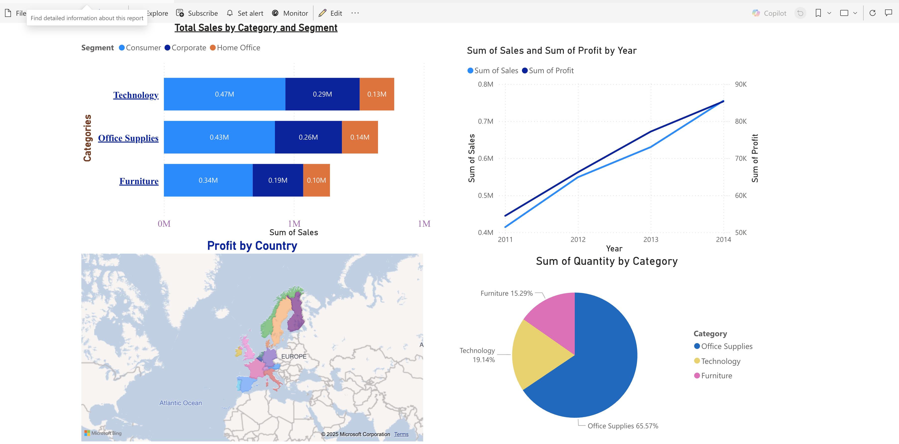

# 📊 Power BI Report: Sales & Profit Analysis Dashboard

This project showcases an interactive Power BI dashboard designed to analyze **sales performance, profit distribution, and product category insights** across regions and customer segments.

The dashboard integrates multiple visualizations to provide a comprehensive overview of business performance over time, supporting strategic decision-making and trend analysis.

---

## 📷 Dashboard Preview

---

## 🚀 Key Features

### **1. Total Sales by Category and Segment**
A horizontal stacked bar chart that compares sales performance across:
- Technology  
- Office Supplies  
- Furniture  

Segment breakdown includes:
- Consumer  
- Corporate  
- Home Office  

This helps identify which segments drive the highest revenue within each product category.

---

### **2. Sales & Profit by Year**
A dual-line chart showing:
- **Sum of Sales**  
- **Sum of Profit**  

Across multiple calendar years.  
This visualization highlights business growth trends and the relationship between sales volume and profitability.

---

### **3. Profit by Country**
A geographical map visualization that displays profit distribution across European countries.  
Useful for:
- Regional market analysis  
- Identifying high-profit and low-profit areas  
- Strategic expansion planning  

---

### **4. Quantity by Category (Pie Chart)**
A proportional breakdown of product quantities sold across:
- Office Supplies  
- Technology  
- Furniture  

This chart shows inventory distribution and helps analyze product demand.

---

## 🛠️ Tools & Technologies Used
- **Power BI Desktop**
- **Power Query**
- **DAX (Data Analysis Expressions)**
- **Interactive Visualizations**
- **Data Modeling & Cleaning**

---

## 📁 Project Structure
- `.pbix` file (main report)
- Images folder (screenshot)
- README documentation

---

## 🌐 Please visit my PowerBI projects:

👉 [Link to my report](https://app.powerbi.com/groups/me/reports/8ec1722b-9888-499b-b976-c709ad47ecbc/996bf351c2c222151c70?experience=power-bi) 

---

## 📬 Contact
For questions or collaborations, feel free to reach out!  
